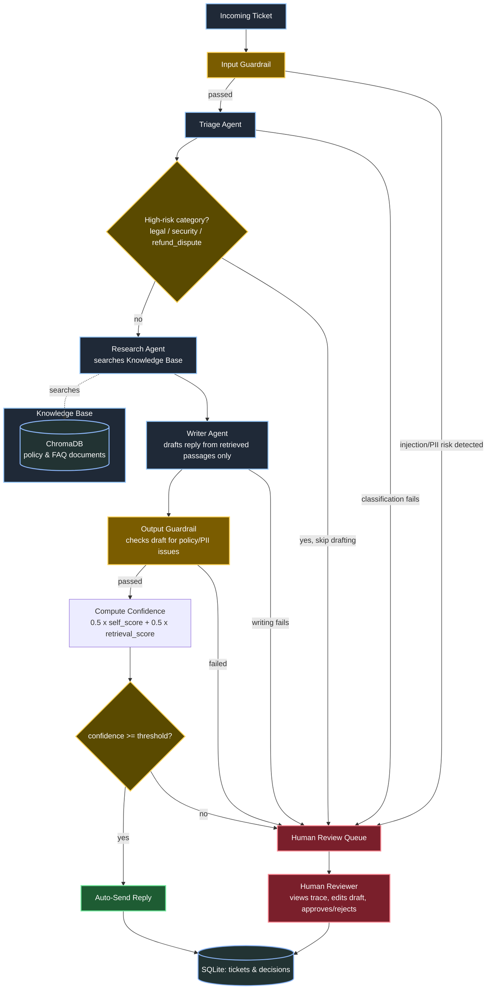

# Customer Support Triage & Resolution System

An agentic AI pipeline that classifies incoming support tickets, retrieves answers from a knowledge base (RAG), drafts replies, and escalates to a human whenever confidence is low. Built with **CrewAI**, **Groq**, and **ChromaDB**.

The core design principle: **agents reason, code decides.** Every action that could reach a customer — auto-sending a reply, escalating to a human — is a deterministic decision in plain Python, never something an LLM is trusted to self-assess.

---

## Why this project

Most "AI support bot" demos stop at "LLM answers a question." This one demonstrates the three things that separate a demo from a production system:

- **RAG grounded in a real knowledge base** — the writer agent can only use retrieved passages, not its own memory, and it's tested to correctly refuse to invent an answer.
- **Human-in-the-loop by design** — a confidence score computed from two independent signals (retrieval strength + the model's own self-assessment) decides whether a reply auto-sends or waits for a human.
- **Guardrails at both ends** — every ticket is checked for prompt injection and PII before it reaches an agent, and every draft is checked for policy violations before it can be approved.

---

## Architecture



**Key design choices visible in the diagram:**
- **Two guardrails (yellow)** bookend every LLM step — nothing unchecked goes in, nothing unchecked goes out.
- **High-risk categories exit before drafting** — a legal or security ticket never reaches the writer, so there's no AI-drafted reply to accidentally approve.
- **The confidence gate is a plain equation**, not a model's opinion of itself.
- **Every exit path converges on either auto-send or the human queue** — there is no third option, and no silent failure mode.

---

## Tech stack

| Layer | Choice | Why |
|---|---|---|
| Agent framework | [CrewAI](https://crewai.com) (Crews for reasoning, plain Python for orchestration) | Crews for classification/RAG/drafting; orchestration kept in code for testability and reliability |
| LLM provider | [Groq](https://groq.com) | Free tier, fast inference; models split by task to multiply the effective free-tier token budget |
| Embeddings | Hugging Face Inference API (`all-MiniLM-L6-v2`) | Free, no local GPU needed |
| Vector store | ChromaDB (local, persistent) | Zero-setup RAG storage |
| API | FastAPI | Ticket submission, review queue, approve/reject endpoints |
| Storage | SQLite | Simple persistence for ticket state and decisions |
| Validation | Pydantic | Every LLM output is schema-validated before it's trusted |

### Models used (all free-tier Groq)

| Purpose | Model | Notes |
|---|---|---|
| Triage | `openai/gpt-oss-20b` | Fast classification |
| Research + Writer | `openai/gpt-oss-120b` | Stronger reasoning for drafting |
| Input guardrail | `meta-llama/llama-prompt-guard-2-22m` (best-effort) + regex (guaranteed) | Injection/PII detection |
| Output guardrail | `openai/gpt-oss-safeguard-20b` | Policy compliance check on drafts |

Each task uses a **different model**, which gives each its own separate Groq rate-limit bucket (limits apply per model ID) — a free way to multiply total throughput instead of one shared budget.

---

## Workflow, step by step

1. **Input guardrail** — PII (email/phone/card) is masked; the ticket is checked for prompt-injection phrases via regex (guaranteed) and a classifier model (best-effort signal). A flagged ticket goes straight to human review.
2. **Triage** — an LLM agent classifies the ticket into a category, priority (1–4), and sentiment, returned as validated JSON (not a forced tool-call, which broke on Groq).
3. **High-risk check** — `legal`, `security`, and `refund_dispute` categories are escalated immediately, before any reply is drafted.
4. **Research** — an agent searches the knowledge base (ChromaDB) via a tool and returns the matching passages with their source files.
5. **Writer** — a second agent drafts a reply using *only* the retrieved passages, and self-scores how fully the passages answered the question. If nothing relevant was found, it honestly says so instead of guessing.
6. **Output guardrail** — the draft is checked for PII leakage (regex) and policy violations — over-promising, unprofessional tone — via a safety-tuned model.
7. **Confidence scoring** — computed in code as `0.5 × self_score + 0.5 × retrieval_confidence`, where `retrieval_confidence` comes from a direct, code-level KB search — never from the agent's own tool call.
8. **Routing** — confidence at or above the threshold (default `0.75`) auto-sends; otherwise the ticket, full trace, and draft go to the human review queue.
9. **Human review** — a reviewer opens `/review`, sees the full decision trace, edits the draft if needed, and approves or rejects.

---

## Project structure
support-triage/
├── data/kb/ # Knowledge base source documents (.md)
├── src/support_triage/
│ ├── config.py # Settings (models, thresholds, paths)
│ ├── schemas.py # Pydantic models for every structured output
│ ├── embeddings.py # Hugging Face embedding backend
│ ├── ingest.py # Chunks + embeds KB docs into ChromaDB
│ ├── guardrails.py # Input/output safety checks
│ ├── flow.py # Orchestration + confidence-gate decision logic
│ ├── db.py # SQLite persistence
│ ├── api.py # FastAPI app + review UI
│ ├── tools/kb_search.py # RAG search tool + code-level search_kb()
│ └── crews/
│ ├── triage_crew/ # Classification agent
│ └── research_writer_crew/ # RAG research + reply-drafting agents
└── tests/

---

## Setup

```bash
python -m venv .venv && source .venv/bin/activate
pip install -e .
cp .env.example .env   # add your GROQ_API_KEY and HF_TOKEN
python -m support_triage.ingest   # build the knowledge base
```

## Running

```bash
uvicorn support_triage.api:app --reload
```

- Submit a ticket: `POST /tickets`
- List tickets: `GET /tickets?status=pending`
- View one ticket: `GET /tickets/{id}`
- Approve / reject: `POST /tickets/{id}/approve` / `/reject`
- Review queue UI: `GET /review`

---

## Known limitations (honest scope cuts, not oversights)

- **Ticket submission is synchronous** — `POST /tickets` blocks for 20–40 seconds under Groq's free-tier pacing. A production deployment would push processing to a background queue (Celery/arq) and return a "queued" status immediately.
- **No authentication** on the API or review UI — acceptable for local/portfolio use, not for deployment.
- **Free-tier Groq rate limits** (8,000 tokens/minute per model) cap throughput; the Developer tier or a paid plan would remove this constraint.
- **Prompt-injection classifier model** is used as a best-effort secondary signal only, since its exact Groq response format isn't fully documented; the deterministic regex check is the guaranteed primary defense.

---

## Evaluation

See `tests/` for unit tests covering guardrail logic, confidence-score math, and Flow routing, and `evals/` for an end-to-end accuracy report against a labeled ticket set.
